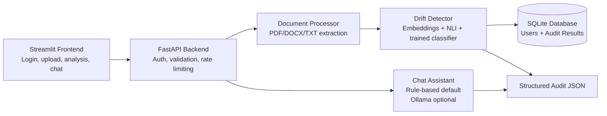

# Requirement Drift & Consistency Auditor

> AI-powered requirement auditing for product, QA, and engineering teams to detect semantic drift, contradictions, and test-coverage gaps between evolving software requirements.

## Project Title and Tagline

Requirement Drift & Consistency Auditor

Tagline: AI-powered requirement auditing for faster, safer requirement evolution in software delivery teams.

## Overview

Modern software teams frequently update requirements during sprint planning, redesign, or compliance reviews. Those changes often introduce semantic drift, contradictions, or missing validation coverage without any clear indication. The Requirement Drift & Consistency Auditor addresses this by comparing an original requirement with an updated requirement, analyzing their semantic similarity and contradiction patterns, and flagging the severity of the change.

This project is designed for:

- Product managers reviewing requirement changes
- QA engineers checking for overlooked regressions
- Engineering leads monitoring specification consistency
- Teams that want a lightweight, explainable decision-support tool before implementation

The core value proposition is to reduce the risk of hidden requirement regressions by surfacing drift, contradiction, and test-coverage impacts early in the lifecycle.

## Key Features

- Requirement-to-requirement comparison using embedding similarity and NLI contradiction detection
- Severity classification across four labels: STABLE, LOW_DRIFT, MEDIUM_DRIFT, and CONFLICT
- Authentication and session handling with JWT-protected API routes
- File upload support for PDF, DOCX, and TXT documents
- Audit history tracking by user with ownership-based retrieval
- Chat assistant for explaining recent audit results
- Optional local LLM support via Ollama with a rule-based fallback
- Security controls including rate limiting, strong password validation, and input sanitization

## Tech Stack

### Model and Data Layer

- Sentence Transformers: semantic embedding generation with all-MiniLM-L6-v2
- Cross-encoder NLI model: distilroberta-base for contradiction detection
- Scikit-learn: severity classification and model tuning
- Pandas and CSV datasets: training, validation, and test datasets under the data directory
- SQLAlchemy + SQLite: audit storage and user metadata

### Backend

- FastAPI: REST API, validation, routing, and secure cookie-based authentication
- Pydantic: strict request validation and sanitization
- SlowAPI: rate limiting for abuse prevention
- Python-JOSE + Passlib + bcrypt: secure JWT and password hashing
- python-magic, PyMuPDF, and python-docx: safe file parsing for document uploads

### Frontend

- Streamlit: responsive dashboard and user-facing analysis workflow
- Plotly: metric visualization and severity presentation

### Deployment and Operations

- Docker: containerized deployment and build validation
- GitHub Actions: CI pipeline for linting, testing, and container scanning
- Optional Hugging Face Spaces deployment path for cloud hosting

## Architecture Diagram



## Project Structure

```text
requirement-drift-auditor/
├── app/
│   ├── chatbot.py               # default rule-based assistant
│   ├── database.py              # SQLAlchemy models and DB session setup
│   ├── document_processor.py    # file validation and extraction logic
│   ├── drift_detector.py        # embedding + NLI + severity logic
│   ├── llm_chatbot.py           # optional Ollama-based assistant
│   ├── main.py                 # FastAPI application and routes
│   ├── schemas.py              # request validation schemas
│   └── security.py             # JWT, hashing, rate limiting, headers
├── data/
│   ├── generate_dataset.py     # dataset generation utility
│   ├── train.csv               # training data
│   ├── val.csv                 # validation data
│   └── test.csv                # test data
├── frontend/
│   └── streamlit_app.py        # UI dashboard
├── models/
│   ├── severity_classifier.joblib
│   └── training_results.json   # evaluation metrics and model selection record
├── tests/
│   ├── integration/
│   ├── security/
│   └── unit/
├── .env.example                # environment variable template
├── .github/workflows/ci-cd.yml # GitHub Actions automation
├── compare_models.py           # Model comparison summary
├── data/generate_dataset.py    # dataset build script
├── Dockerfile                  # container build for backend service
├── docker-compose.yml          # orchestration definition
├── pytest.ini                 # pytest configuration
├── requirements.txt            # local environment dependencies
├── requirements-dev.txt        # test and security tooling
├── requirements-docker.txt     # container deployment dependencies
├── train_severity_classifier.py
├── README.md
└── .gitignore
```

## Setup Instructions

### 1. Clone the repository

```bash
git clone https://github.com/<your-username>/requirement-drift-auditor.git
cd requirement-drift-auditor
```

### 2. Create a Python virtual environment

#### Windows (PowerShell)

```powershell
py -3.11 -m venv .venv
.\.venv\Scripts\Activate.ps1
pip install --upgrade pip
```

#### macOS/Linux

```bash
python3 -m venv .venv
source .venv/bin/activate
python -m pip install --upgrade pip
```

### 3. Install dependencies

```bash
pip install -r requirements.txt -r requirements-dev.txt
```

### 4. Configure environment variables

Copy the example environment file and populate it with real values:

```bash
copy .env.example .env
```

Then edit `.env` with your runtime configuration. Do not commit real secrets to the repository.

### 5. Train the classifier

The severity model is trained from the packaged dataset and saved into the models directory.

```bash
python data/generate_dataset.py
python train_severity_classifier.py
python compare_models.py
```

### 6. Run the application locally

Start the backend:

```bash
uvicorn app.main:app --reload
```

In a separate terminal, start the UI:

```bash
streamlit run frontend/streamlit_app.py
```

Open the Streamlit app in the browser, register an account, and begin auditing requirement pairs.

## Environment Variables

The project reads configuration from environment variables at runtime. A ready-to-copy template is included in `.env.example`.

| Variable | Required | Description | Example |
| --- | --- | --- | --- |
| `JWT_SECRET_KEY` | Yes | Secret key used to sign authentication JWTs | `change-me-to-a-long-random-string` |
| `DATABASE_URL` | Yes | Database connection string for app storage | `sqlite:///./app.db` |
| `ALLOWED_ORIGINS` | Yes | Comma-separated CORS origins allowed by the backend | `http://localhost:8501` |
| `CHATBOT_ENGINE` | No | Chatbot backend selection | `rule_based` or `llm` |
| `COOKIE_SECURE` | No | Whether the auth cookie is sent only over HTTPS | `true` |
| `EMBEDDER_MODEL` | No | Override for the sentence-transformer used for embeddings | `all-MiniLM-L6-v2` |
| `NLI_MODEL` | No | Override for the contradiction model | `cross-encoder/nli-distilroberta-base` |
| `API_URL` | Frontend only | Backend URL used by Streamlit | `http://localhost:8000` |

## API Documentation

The backend exposes a protected FastAPI API. Most analysis endpoints require an authenticated cookie session.

### Authentication

#### POST /auth/register

Creates a new user account.

Request body:

```json
{
  "email": "user@example.com",
  "password": "Passw0rd1"
}
```

Response:

```json
{
  "message": "Registered successfully."
}
```

#### POST /auth/login

Authenticates the user and sets an `access_token` cookie.

Request body:

```json
{
  "email": "user@example.com",
  "password": "Passw0rd1"
}
```

Response:

```json
{
  "message": "Logged in."
}
```

#### POST /auth/logout

Clears the authentication cookie.

Response:

```json
{
  "message": "Logged out."
}
```

### Requirement Analysis

#### POST /analyze

Analyzes two raw requirement strings.

Request body:

```json
{
  "req_original": "The system must respond within 2 seconds.",
  "req_updated": "The system must respond within 20 seconds."
}
```

Example response:

```json
{
  "req_original": "The system must respond within 2 seconds.",
  "req_updated": "The system must respond within 20 seconds.",
  "cosine_similarity": 0.9231,
  "nli_label": "neutral",
  "nli_scores": {
    "contradiction": 0.06,
    "entailment": 0.18,
    "neutral": 0.76
  },
  "severity": "LOW_DRIFT",
  "model_disagreement_flag": false,
  "audit_id": 12
}
```

#### POST /upload-analyze

Uploads two files and analyzes their extracted text.

Request format: multipart/form-data with `original_file` and `updated_file`.

Supported file types: PDF, DOCX, and TXT.

#### GET /audits/{audit_id}

Returns the stored audit result for the authenticated user. Access is restricted by ownership.

#### POST /chat

Asks a question about a prior audit result. The assistant answers based on the stored structured audit JSON.

Request body:

```json
{
  "audit_id": 12,
  "question": "How many requirements changed?"
}
```

Example response:

```json
{
  "answered": true,
  "message": "1 of 1 requirement pairs show drift.",
  "engine": "rule_based"
}
```

#### GET /health

Returns a simple health status for service monitoring.

```json
{
  "status": "ok"
}
```

## Usage Examples

### Example 1: Compare requirement changes

Use the text-analysis workflow in the Streamlit app to compare an original and updated requirement:

- Original: "The system must respond within 2 seconds."
- Updated: "The system must respond within 20 seconds."

Expected result: severity likely appears as LOW_DRIFT or MEDIUM_DRIFT depending on semantic distance and contradiction detection.

### Example 2: Upload document pair

Upload:

- Original SRS or requirement document
- Updated SRS or requirement document

The app validates file type, extracts text, and runs the same analysis pipeline on the normalized content.

### Example 3: Ask the assistant

The assistant can answer questions such as:

- How many requirements changed?
- Were any contradictions found?
- Why was the severity flagged?
- Are there any coverage gaps?

## Model Details

### Architecture

The project uses a hybrid detection pipeline:

1. Sentence embeddings are generated using a pre-trained transformer model.
2. A cosine similarity signal is computed between the original and updated requirement vectors.
3. A cross-encoder NLI model is used to determine whether the pair is contradictory, entailed, or neutral.
4. A trained classifier maps the fused feature vector to one of four severity classes.

### Training Data

The project uses CSV-based requirement pairs under the `data/` directory, split into train, validation, and test sets.

### Model Performance

The latest recorded training results from `models/training_results.json` show:

- Selected model: `iteration_mlp`
- Validation macro-F1: `0.8475`
- Test accuracy: `0.8750`
- Test macro-F1: `0.8764`

This indicates a solid baseline for rule-based requirement-change classification in a controlled experimental dataset.

### Inference Notes

- The default path is rule-based and deterministic.
- The optional LLM path uses an Ollama-hosted local model and falls back automatically if unavailable.
- The model is tuned for explainability and practical auditing rather than full legal or compliance-grade assurance.

## Testing

The repository includes a structured testing pipeline for security, unit, and integration coverage.

### Run tests locally

```bash
pytest -m security -v
pytest -m unit -v
pytest -m integration -v
```

For coverage output:

```bash
pytest --cov=app --cov-report=term-missing
```

### Test categories

- Security: password validation, auth requirements, IDOR protection, rate limiting, oversized input rejection
- Unit: requirement comparison logic and fallback chatbot behavior
- Integration: end-to-end authentication + analysis + audit retrieval + chat flow

## Deployment

### Local deployment

The application is designed to run locally on a developer machine or internal staging environment.

```bash
uvicorn app.main:app --host 0.0.0.0 --port 8000
streamlit run frontend/streamlit_app.py
```

### Docker deployment

```bash
docker build -t requirement-auditor:latest .
docker run --rm --env-file .env -p 7860:7860 requirement-auditor:latest
```

### Cloud deployment guidance

The repository includes a CI/CD workflow and Docker build configuration for deployment to cloud-hosted environments such as Hugging Face Spaces, container-hosting platforms, or a private internal server. The codebase is designed for a local-first deployment model with optional cloud hosting, rather than a fully production-managed SaaS deployment.

## Known Limitations

This project is a strong prototype and decision-support tool, but it has clear boundaries:

- It is optimized for structured requirement text, not complex legal or highly ambiguous specification documents.
- The default severity model is trained on a curated synthetic dataset and should not be treated as a universal requirement-quality oracle.
- The LLM mode is optional and local-only; it is not intended as a cloud-hosted generative AI service.
- File extraction is limited to PDF, DOCX, and TXT formats.
- The system flags likely drift but does not replace formal requirement review, domain verification, or sign-off workflows.

## Future Improvements

- Add multilingual support for non-English requirement documents
- Incorporate traceability metadata such as requirement IDs and ownership tags
- Expand the dataset with real-world enterprise requirement examples
- Add more granular explanation reasons for each severity decision
- Support export of audit results as PDF or CSV reports
- Integrate user role management and admin oversight for larger teams
- Add a hosted production deployment pipeline and environment hardening review

## License

This repository does not currently include a formal license file. At the moment, the project is effectively unlicensed unless a license is added. 

## Author and Contact

Author: Hoor Ul Ain Wajid

Program: AI / Data Science Internship Project

Submission Date: 2026-08-31


