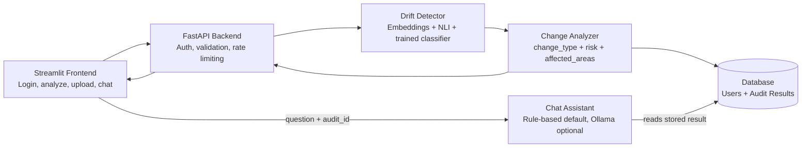

# Requirement Drift & Consistency Auditor (ReqLens)

> AI-powered requirement change auditing for product, QA, and engineering teams — detects semantic drift, contradictions, change type, risk, and affected system areas between evolving software requirements.

## Project Title and Tagline

Requirement Drift & Consistency Auditor — internally branded **ReqLens** in the API title and frontend UI.

Tagline: AI-powered requirement change auditing for faster, safer requirement evolution in software delivery teams.

## Overview

Modern software teams frequently update requirements during sprint planning, redesign, or compliance reviews. Those changes often introduce semantic drift, contradictions, or missing validation coverage without any clear indication. The Requirement Drift & Consistency Auditor addresses this by comparing an original requirement with an updated requirement, analyzing semantic similarity and contradiction patterns, and going one step further than a similarity score: it classifies **what kind of change occurred**, assigns a **risk level**, and flags **which parts of the system are likely affected**.

This project is designed for:

- Product managers reviewing requirement changes
- QA engineers checking for overlooked regressions
- Engineering leads monitoring specification consistency
- Teams that want a lightweight, explainable decision-support tool before implementation

The core value proposition is to reduce the risk of hidden requirement regressions by surfacing drift, contradiction, change type, and impact early in the lifecycle — not just "these two texts are 92% similar."

## Key Features

- Requirement-to-requirement comparison using embedding similarity and NLI contradiction detection
- Severity classification across four labels: `STABLE`, `LOW_DRIFT`, `MEDIUM_DRIFT`, `CONFLICT`
- **Change-type classification** on top of severity: `STABLE`, `MODIFICATION`, `ADDITION`, `REMOVAL`, `CONTRADICTION`, `STATUS_CHANGE`, `SCOPE_CHANGE`, `CONSTRAINT_CHANGE`
- **Risk scoring** (`LOW` / `MEDIUM` / `HIGH`) with human-readable reasons for every classification
- **Affected-area tagging** (authentication, storage, API, performance, security, frontend, testing, and more) inferred from requirement text
- **Document-level audits**: an uploaded SRS document pair is split into individual `REQ-xxx` statements, aligned across versions, and audited requirement-by-requirement — not scored as one undifferentiated blob
- Dashboard endpoint aggregating stats (documents analyzed, requirements analyzed, high-risk changes, conflicts) across a user's full audit history
- Authentication and session handling with JWT-protected, httpOnly cookie-based API routes
- File upload support for PDF, DOCX, and TXT documents
- Audit history tracking by user with ownership-based retrieval (IDOR-protected)
- Chat assistant ("Audit Analyst") that answers questions about change type, risk, and affected areas for a stored audit
- Optional local LLM support via Ollama with an automatic rule-based fallback
- CI "Requirement Change Gate" script that can fail a pipeline on HIGH-risk changes
- Security controls including rate limiting, strong password validation, and input sanitization

## Tech Stack

### Model and Data Layer

- Sentence Transformers: semantic embedding generation with `all-MiniLM-L6-v2`
- Cross-encoder NLI model: `cross-encoder/nli-distilroberta-base` for contradiction detection (overridable via `NLI_MODEL`, including for memory-constrained hosting — see Deployment)
- Scikit-learn: severity classification and model tuning — the classifier's feature vector includes the NLI scores, not embeddings alone
- Pandas and CSV datasets: training, validation, and test datasets under `data/`
- SQLAlchemy + SQLite (Postgres-compatible via `DATABASE_URL`): audit storage and user metadata

### Backend

- FastAPI: REST API, validation, routing, and secure cookie-based authentication
- Pydantic: strict request validation and sanitization
- SlowAPI: rate limiting for abuse prevention
- Python-JOSE + Passlib + bcrypt: secure JWT and password hashing
- python-magic, PyMuPDF, and python-docx: safe, content-sniffed file parsing for document uploads

### Frontend

- Streamlit: dashboard, analysis workflow, document audit, change log, and chat assistant views
- Plotly: donut/summary charts for change-type and risk breakdowns
- Deployed separately from the backend with its own scoped `frontend/requirements.txt` (see Deployment)

### Deployment and Operations

- Docker: containerized backend deployment and CI build validation
- GitHub Actions: CI pipeline for linting, testing (security/unit/integration), security scanning (Bandit, pip-audit), and Docker build
- Render (free tier): backend hosting
- Streamlit Community Cloud (free tier): frontend hosting
- Optional Render Postgres for persistent storage beyond the free tier's ephemeral SQLite

## Architecture Diagram

The diagram below is a simplified entry point. **See [`ARCHITECTURE.md`](./ARCHITECTURE.md) for the complete, correct architecture** — including the document-splitting path, the authentication sequence, and the deployment topology, none of which fit in a single diagram.



Note the correction from earlier versions of this diagram: the **Change Analyzer** is not optional decoration — it is what every `/analyze` and `/upload-analyze` response actually contains, and the **Chat Assistant reads a previously stored result from the database**; it does not sit inline in the live analysis path.

## Project Structure

```text
requirement-drift-auditor/
├── app/
│   ├── change_analyzer.py       # change-type classification, risk scoring, affected areas
│   ├── chatbot.py                # default rule-based "Audit Analyst" assistant
│   ├── database.py               # SQLAlchemy models and DB session setup
│   ├── document_processor.py     # file validation and extraction logic
│   ├── drift_detector.py         # embedding + NLI + severity logic
│   ├── llm_chatbot.py            # optional Ollama-based assistant
│   ├── main.py                   # FastAPI application and routes
│   ├── requirement_splitter.py   # splits/aligns documents into REQ-xxx pairs
│   ├── schemas.py                # request validation schemas
│   └── security.py               # JWT, hashing, rate limiting, headers
├── data/
│   ├── generate_dataset.py       # dataset generation utility (incl. state-change examples)
│   ├── train.csv / val.csv / test.csv
├── frontend/
│   ├── .streamlit/config.toml    # dark theme configuration
│   ├── requirements.txt          # scoped frontend-only dependencies (streamlit, requests, plotly)
│   └── streamlit_app.py          # UI dashboard
├── models/
│   ├── severity_classifier.joblib
│   └── training_results.json     # evaluation metrics and model selection record
├── tests/
│   ├── integration/
│   ├── security/
│   └── unit/                     # includes a dedicated change_analyzer regression test
├── .env.example
├── .github/workflows/ci-cd.yml
├── ARCHITECTURE.md                # full architecture reference
├── ci_requirement_gate.py         # CI quality gate on audit risk
├── compare_models.py
├── Dockerfile
├── docker-compose.yml
├── pytest.ini
├── requirements.txt               # local (Windows) environment dependencies
├── requirements-dev.txt           # test and security tooling
├── requirements-docker.txt        # Linux/container deployment dependencies
├── train_severity_classifier.py
├── README.md
└── .gitignore
```

## Setup Instructions

### 1. Clone the repository

```bash
git clone https://github.com/<your-username>/requirement-drift-auditor.git
cd requirement-drift-auditor
```

### 2. Create a Python virtual environment

#### Windows (PowerShell)

```powershell
py -3.11 -m venv .venv
.\.venv\Scripts\Activate.ps1
pip install --upgrade pip
```

#### macOS/Linux

```bash
python3 -m venv .venv
source .venv/bin/activate
python -m pip install --upgrade pip
```

### 3. Install dependencies

```bash
pip install -r requirements.txt -r requirements-dev.txt
```

### 4. Configure environment variables

```bash
copy .env.example .env
```

Then edit `.env` with your runtime configuration. Do not commit real secrets to the repository.

### 5. Train the classifier

```bash
python data/generate_dataset.py
python train_severity_classifier.py
python compare_models.py
```

### 6. Run the application locally

Start the backend:

```bash
uvicorn app.main:app --reload
```

In a separate terminal, start the UI:

```bash
streamlit run frontend/streamlit_app.py
```

Open the Streamlit app in the browser, register an account, and begin auditing requirement pairs.

## Environment Variables

| Variable | Required | Description | Example |
| --- | --- | --- | --- |
| `JWT_SECRET_KEY` | Yes | Secret key used to sign authentication JWTs | `change-me-to-a-long-random-string` |
| `DATABASE_URL` | Yes | Database connection string for app storage | `sqlite:///./app.db` |
| `ALLOWED_ORIGINS` | Yes | Comma-separated CORS origins allowed by the backend | `http://localhost:8501` |
| `CHATBOT_ENGINE` | No | Chatbot backend selection | `rule_based` or `ollama` |
| `COOKIE_SECURE` | No | Whether the auth cookie is sent only over HTTPS (must be `true` in any real deployment) | `true` |
| `EMBEDDER_MODEL` | No | Override for the sentence-transformer used for embeddings | `all-MiniLM-L6-v2` |
| `NLI_MODEL` | No | Override for the contradiction model — useful for reducing memory footprint on constrained hosting | `cross-encoder/nli-distilroberta-base` |
| `API_URL` | Frontend only | Backend URL used by Streamlit, set as a Streamlit Cloud secret | `https://your-service.onrender.com` |

## API Documentation

Most analysis endpoints require an authenticated cookie session.

### Authentication

#### POST /auth/register
Creates a new user account.

#### POST /auth/login
Authenticates the user and sets an `access_token` httpOnly cookie.

#### POST /auth/logout
Clears the authentication cookie.

### Requirement Analysis

#### POST /analyze

Analyzes two raw requirement strings and returns the full enriched result.

Request body:
```json
{
  "req_original": "Our goal is to create an end-to-end ML pipeline.",
  "req_updated": "We have created an end-to-end ML pipeline."
}
```

Response:
```json
{
  "req_original": "Our goal is to create an end-to-end ML pipeline.",
  "req_updated": "We have created an end-to-end ML pipeline.",
  "cosine_similarity": 0.9431,
  "nli_label": "entailment",
  "nli_scores": { "contradiction": -2.2991, "entailment": 3.0762, "neutral": -0.4402 },
  "severity": "LOW_DRIFT",
  "model_disagreement_flag": false,
  "change_type": "STATUS_CHANGE",
  "risk": "LOW",
  "reasons": ["Objective is unchanged; only implementation status changed (planned -> completed)."],
  "affected_areas": [],
  "req_id": "inline",
  "audit_id": 12
}
```

#### POST /upload-analyze

Uploads two documents, splits each into individual requirement statements, aligns them by ID, and audits every requirement pair. Request format: `multipart/form-data` with `original_file` and `updated_file`. Supported types: PDF, DOCX, TXT.

Response: `{ "audit_id": ..., "summary": { "total": ..., "stable": ..., "high_risk": ..., ... }, "results": [ ...per-requirement enriched results... ] }`

#### GET /audits/{audit_id}
Returns the stored audit result and summary for the authenticated user. Access is restricted by ownership.

#### GET /audits
Lists all of the authenticated user's past audits with summary counts, most recent first.

#### GET /dashboard
Returns aggregate stats across all of the authenticated user's audits: documents analyzed, requirements analyzed, changes detected, high-risk changes, potential conflicts.

#### POST /chat
Asks a question about a prior audit. The assistant answers from the stored structured audit JSON — it can answer questions about risk, conflicts, affected areas, and what needs review, not only "how many changed."

#### GET /health
Returns `{"status": "ok"}` for service monitoring.

## Usage Examples

### Example 1: Compare requirement changes
- Original: "The system must respond within 2 seconds."
- Updated: "The system must respond within 20 seconds."

Expected result: `CONSTRAINT_CHANGE`, `HIGH` risk, with a reason citing the percentage the constraint was relaxed by.

### Example 2: Upload document pair
Upload an original and updated SRS. The app validates file type, extracts text, splits both into individual requirements, aligns them, and returns a per-requirement breakdown plus a summary (e.g. "127 requirements analyzed: 92 stable, 18 modified, 7 added, 5 removed, 3 conflicts").

### Example 3: Ask the assistant
- "How many requirements changed?"
- "Which changes are high risk?"
- "What's affected?"
- "What needs review?"

## Model Details

### Architecture

1. Sentence embeddings are generated for both requirement versions.
2. A cosine similarity signal is computed between the two vectors.
3. A cross-encoder NLI model determines whether the pair is contradictory, entailed, or neutral.
4. A trained classifier maps a fused feature vector — **embeddings plus NLI scores** — to one of four severity classes.
5. A deterministic Change Analyzer layer converts the ML output into change type, risk, reasons, and affected areas.

### Training Data

CSV-based requirement pairs under `data/`, split 70/15/15 into train/validation/test with stratification. The generator includes numeric-change, negation, and **state-change** (e.g. "goal to create" → "have created") templates — the last of these exists specifically to prevent the classifier from mistaking a status update for a contradiction.

### Model Performance

From `models/training_results.json`:
- Selected model: `iteration_mlp`
- Validation macro-F1: `0.8475`
- Test accuracy: `0.8750`
- Test macro-F1: `0.8764`

### Inference Notes

- The default path is rule-based and deterministic.
- The optional LLM path uses an Ollama-hosted local model (`qwen3:1.7b`, chosen for its small memory footprint) and falls back automatically if unavailable or slow.
- The model is tuned for explainability and practical auditing rather than full legal or compliance-grade assurance.

## Testing

```bash
pytest -m security -v
pytest -m unit -v
pytest -m integration -v
pytest --cov=app --cov-report=term-missing
```

### Verified results (local run)

| Category | Tests | Result |
| --- | --- | --- |
| Security | 5 | 5 passed |
| Unit | 5 | 5 passed |
| Integration | 1 | 1 passed |

Coverage: 70% overall, 100% on `drift_detector.py`. Bandit static analysis: no issues identified across 469 lines. `pip-audit` currently flags 63 known vulnerabilities across 9 pinned packages (notably `torch`, `starlette`, `streamlit`, `transformers`) — a version-pinning issue to address before production use, not a defect in the project's own code.

## Deployment

### Local deployment

```bash
uvicorn app.main:app --host 0.0.0.0 --port 8000
streamlit run frontend/streamlit_app.py
```

### Docker deployment (backend)

```bash
docker build -t requirement-auditor:latest .
docker run --rm --env-file .env -p 7860:7860 requirement-auditor:latest
```

### Cloud deployment: Render + Streamlit Community Cloud

Hugging Face Spaces is **not** used for this project's live deployment — as of mid-2026, Spaces running Docker or Gradio require a paid plan on personal accounts. The verified free path is:

- **Backend → Render** (Docker web service, free tier). Point it at the repository; it builds from `Dockerfile` automatically. Set `JWT_SECRET_KEY`, `DATABASE_URL`, `ALLOWED_ORIGINS`, `CHATBOT_ENGINE`, `COOKIE_SECURE=true` as environment variables.
- **Frontend → Streamlit Community Cloud** (free). Point it at `frontend/streamlit_app.py`. Set the `API_URL` secret to the Render service URL. The frontend uses its own scoped `frontend/requirements.txt` (streamlit, requests, plotly only) so Streamlit Cloud doesn't attempt to install the full backend stack — including a Windows-only package (`python-magic-bin`) that has no Linux wheel and will hard-fail the build if the root `requirements.txt` is used instead.

**Known free-tier constraint:** Render's free instance provides 512 MB RAM. Loading the sentence embedder and NLI cross-encoder together can approach or exceed that ceiling and trigger a platform-level restart (visible in Render's Events log as "Ran out of memory"). The mitigation used in this deployment is setting the `NLI_MODEL` environment variable to a smaller cross-encoder, which requires no code change. SQLite on Render's free tier is also **not persistent** across restarts; Render's free Postgres add-on (30-day expiry) is the documented fix, requiring only a `DATABASE_URL` change and adding `psycopg2-binary` to `requirements-docker.txt`. Full detail in [`ARCHITECTURE.md`](./ARCHITECTURE.md#6-deployment-topology).

## Known Limitations

- Optimized for structured requirement text, not complex legal or highly ambiguous specification documents.
- The default severity model is trained on a curated synthetic dataset and should not be treated as a universal requirement-quality oracle.
- The requirement splitter used for document-level audits is regex/heuristic-based, tuned for numbered or bulleted SRS documents — not a general-purpose NLP segmenter.
- The LLM chat mode is optional and local-only (Ollama); it is not a cloud-hosted generative AI service.
- File extraction is limited to PDF, DOCX, and TXT formats.
- Free-tier hosting (Render + Streamlit Community Cloud) has real constraints: 512 MB RAM on the backend and non-persistent SQLite storage. Both are documented above with their mitigations, not silently absorbed.
- The system flags likely drift, contradiction, and risk — it does not replace formal requirement review, domain verification, or sign-off workflows.

## Future Improvements

- Add multilingual support for non-English requirement documents
- Replace the regex-based requirement splitter with a proper NLP segmenter
- Incorporate traceability metadata such as requirement IDs and ownership tags beyond the current auto-generated `REQ-xxx`
- Expand the dataset with real-world enterprise requirement examples
- Support export of audit results as PDF or CSV reports
- Integrate user role management and admin oversight for larger teams
- Move off free-tier hosting constraints with a properly sized production deployment and a dependency version upgrade pass

## License

This repository does not currently include a formal license file. At the moment, the project is effectively unlicensed unless a license is added.

## Author and Contact

Author: Hoor Ul Ain Wajid

Program: AI / Data Science Internship Project

Submission Date: 2026-08-31
